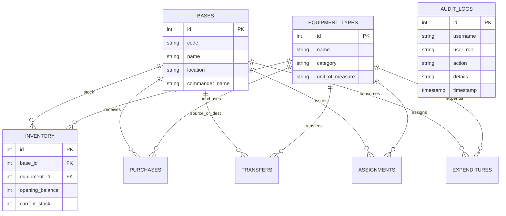

# Military Asset Management System (MAMS)

[](https://opensource.org/licenses/MIT)
[](https://nodejs.org/)
[](https://www.sqlite.org/)
[](https://vitejs.dev/)

A secure, role-based, full-stack **Military Asset Management System (MAMS)** designed for commanders and logistics personnel to manage the movement, assignment, acquisition, and expenditure of critical military assets (vehicles, heavy weapons, small arms, ammunition, and tactical communications gear) across multiple bases.

---

## 🎖️ System Overview & Key Features

### 1. Command Dashboard Metrics
- **Opening Balance**: Baseline inventory total across bases and asset categories.
- **Closing Balance**: Calculated dynamically:  
  $$\text{Closing Balance} = \text{Opening Balance} + \text{Net Movement} - \text{Expended Assets}$$
- **Net Movement**: Total asset flow into/out of bases:  
  $$\text{Net Movement} = \text{Purchases} + \text{Transfers In} - \text{Transfers Out}$$
- **Assigned Assets**: Currently active field and armory assignments to military personnel.
- **Expended Assets**: Quantity consumed during combat operations, live-fire training exercises, or operational wear.
- **Global Filters**: Date Range, Base / Installation, Equipment Type.
- **[Bonus] Interactive Net Movement Drill-down Modal**: Clicking on the **Net Movement** metric card opens a detailed popup containing complete breakdown tables for:
  1. *Purchases* (PO Number, Base, Equipment, Quantity, Total Cost, Supplier)
  2. *Transfers In* (Tracking #, Source Base, Equipment, Quantity, Date, Status)
  3. *Transfers Out* (Tracking #, Destination Base, Equipment, Quantity, Date, Status)

### 2. Asset Procurement Logistics (Purchases Page)
- Record new purchases for assets with PO references, unit costs, and suppliers.
- Filter historical purchases by date range, equipment type, and base.
- Automatic inventory stock update upon recording purchase.

### 3. Inter-Base Asset Transfers (Transfers Page)
- Facilitate asset movements between military installations (e.g. Fort Alpha HQ to Outpost Charlie).
- Real-time stock validation prevents transferring quantities exceeding available stock.
- Lifecycle tracking (`Pending` $\rightarrow$ `In-Transit` $\rightarrow$ `Completed`). Marking transfer as completed updates inventory stocks for both origin and destination bases.

### 4. Personnel Assignments & Operational Expenditures
- **Personnel Issuance**: Assign serialized/bulk items to specific military personnel (Rank, Service ID, Unit). Ability to record asset returns back to armory stock.
- **Operational Expenditures**: Log consumed ammunition/equipment spent during exercises or combat loss. Automatically updates available stock.

### 5. Role-Based Access Control (RBAC) & Audit Logging
- **Role Switcher Demo Bar**: Toggle live between 4 pre-configured military roles:
  1. **Admin (`General Arthur Vance`)**: Full access across all bases and operations.
  2. **Base Commander (`Col. Marcus Miller - Fort Alpha`)**: Full access scoped exclusively to their assigned base.
  3. **Base Commander (`Col. Sarah Davis - Fort Bravo`)**: Full access scoped exclusively to Fort Bravo.
  4. **Logistics Officer (`Lt. James Hayes`)**: Access restricted to **Purchases** and **Transfers** only. Attempting to access Assignments or Expenditures returns HTTP 403 Access Denied.
- **Audit Logging**: Every single transaction (Purchase, Transfer, Assignment, Expenditure) generates an immutable entry in the `audit_logs` table recording timestamp, username, role, action, and payload details.

---

## 🛠️ Architecture & Tech Stack Rationale

| Layer | Tech Stack | Justification |
| :--- | :--- | :--- |
| **Frontend** | React 19, Vite, Tailwind CSS, Lucide Icons, Recharts | Provides a high-performance, dark tactical UI with real-time dynamic metric updates and interactive charts. |
| **Backend** | Node.js, Express.js REST API | Asynchronous non-blocking architecture perfect for handling logistics transactions and middleware RBAC. |
| **Database** | SQLite Relational Database (`sqlite3`) | Provides ACID transactional guarantees, foreign key constraints, zero external database setup, and single-file portability. |
| **Security** | Express Custom Middleware, RBAC Scoping, Audit Trail | Middleware enforces role permissions and base scoping on every API request. |

---

## 🚀 Quick Start & Installation

### Prerequisites
- Node.js (v18+)
- npm (v9+)

### 1. Clone & Setup Project
```bash
git clone <your-repo-url>
cd Assessment
```

### 2. Run Backend Server
```bash
cd backend
npm install
node server.js
```
*The backend server will run on `http://localhost:5000` and automatically create and seed the SQLite database (`mams_military.db`).*

### 3. Run Frontend Client
```bash
# Open a new terminal tab/window
cd frontend
npm install
npm run dev
```
*The React Vite web application will open on `http://localhost:5173`.*

---

## 📊 Database ERD & Schema Overview



---

## 🔒 RBAC Permission Matrix

| Role | Dashboard View | Purchases (Create/View) | Transfers (Create/View) | Assignments (Create/View) | Expenditures (Create/View) | Audit Logs | Base Scope |
| :--- | :---: | :---: | :---: | :---: | :---: | :---: | :---: |
| **Admin** | ✅ Full | ✅ Full | ✅ Full | ✅ Full | ✅ Full | ✅ All | All Bases |
| **Base Commander** | ✅ Scoped | ✅ Base Scoped | ✅ Base Scoped | ✅ Base Scoped | ✅ Base Scoped | ✅ Base Scoped | Assigned Base |
| **Logistics Officer** | ✅ View | ✅ Full | ✅ Full | ❌ Forbidden (403) | ❌ Forbidden (403) | ❌ Restricted | All Bases |

---

## 📜 License
This project is released under the MIT License.
